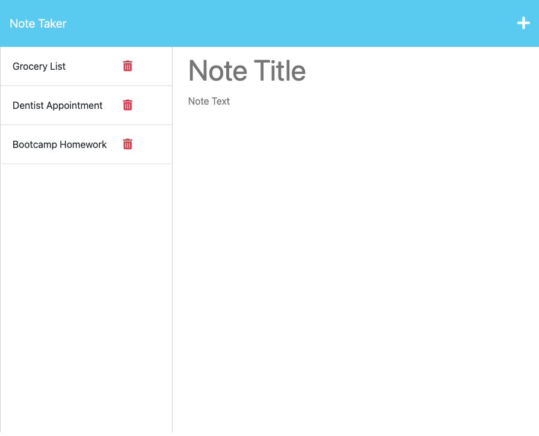

# Note Taker Extraordinaire

## Description

This note app uses express.js on the back end to save and display notes created by the user.

## Installation 

N/A

## Usage

This app can be used by students, entrepreneurs, or any other busy person to keep track of to-dos, assignments, appointments, and any other notes.

[Deployed Website Link](https://note-taker-extraodinaire.herokuapp.com/)

## Credits

I researched an express.js request bug using the following link:
https://stackoverflow.com/questions/9177049/express-js-req-body-undefined

## License

Please refer to the license in the repo.